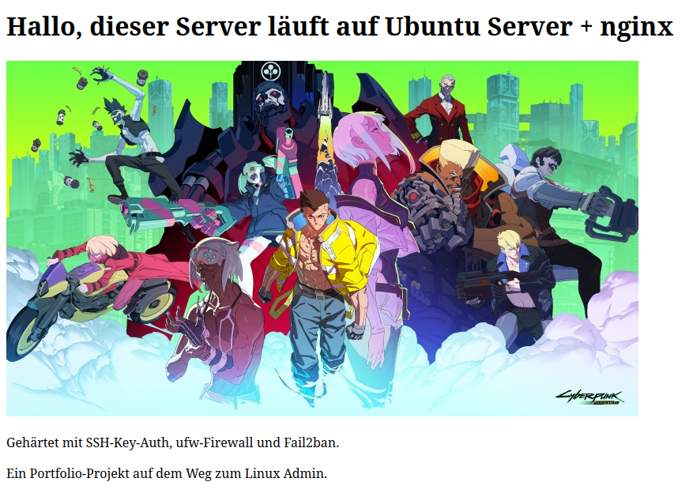

# hardened-web-server
Hardened Ubuntu Server setup with SSH key auth, firewall, and Fail2ban and a self-hosted nginx webpage.

Projekt abgeschlossen – Ziel war es, einen Ubuntu-Server aufzusetzen, abzusichern 
und einen erreichbaren Webserver mit eigener Seite zu betreiben.

- [X] SSH-Key-Auth einrichten, Passwort-Login deaktivieren
- [X] Firewall (ufw) konfigurieren
- [X] Fail2ban installieren und konfigurieren
- [X] nginx installieren
- [X] Eigene Webseite mit Bild einrichten

## VM Setup — Ubuntu Server (VirtualBox)

- VirtualBox installiert via `sudo apt install virtualbox`
- Neue VM erstellt: Name `ubuntu-server-webserver`, Typ Linux/Ubuntu 64-bit
- Ressourcen: 2048 MB RAM, 2 CPU-Kerne, 20 GB dynamische Festplatte
- Netzwerkadapter: erst auf NAT (Standard), zeigte falsche IP (10.0.2.15) 
  → korrigiert auf "Bridged Adapter", damit VM eine echte IP im Heimnetzwerk bekommt
- Ubuntu Server ISO (26.04 LTS) heruntergeladen von ubuntu.com/download/server
- Installation durchlaufen:
  - Sprache: Englisch
  - Tastaturlayout: German
  - Netzwerk: automatisch per DHCP, IP jetzt korrekt im Heimnetz-Bereich
  - Festplatte: "Use entire disk" (gesamte virtuelle Platte)
  - Profil erstellt: Hostname `webserver-lab`, eigener Benutzername + Passwort vergeben
  - Ubuntu Pro Upgrade: übersprungen (nicht benötigt für Lab-Projekt)
  - OpenSSH Server: aktiviert (wichtig für späteren SSH-Zugriff)
  - SSH-Key-Import beim Setup: übersprungen, wird manuell nachträglich eingerichtet
  - Populäre Snaps: keine ausgewählt, Software wird gezielt später über apt installiert
- Installation abgeschlossen, Reboot durchgeführt
- Erster Login erfolgreich, System läuft
- IP-Adresse der VM geprüft mit `ip a` (Interface enp0s3)

## SSH Hardening

- SSH-Key-Paar erzeugt (ed25519) für VM-Zugriff, separat vom GitHub-Key
- Public Key via `ssh-copy-id` auf die VM übertragen
- Key-Login erfolgreich getestet
- Passwort-Login in /etc/ssh/sshd_config auf "no" gesetzt
- Problem: Änderung griff zunächst nicht — Ursache war eine zusätzliche 
  Config-Datei unter /etc/ssh/sshd_config.d/, die PasswordAuthentication yes 
  erzwang und die Haupt-Config überschrieb
- Fix: Wert auch in dieser Datei auf "no" geändert, SSH-Dienst neu gestartet
- Verifiziert: Verbindungsversuch mit `-o PubkeyAuthentication=no` wird jetzt 
  korrekt mit "Permission denied (publickey)" abgelehnt

## Firewall (ufw)

- ufw Status geprüft, war zunächst inaktiv
- SSH (Port 22 / OpenSSH) vor Aktivierung erlaubt, um Aussperren zu vermeiden
- ufw aktiviert (`sudo ufw enable`)
- HTTP (80) und HTTPS (443) zusätzlich freigegeben, für späteren nginx-Webserver
- Doppelte Regel (OpenSSH + separates Port-22-Allow) bereinigt
- Ergebnis: nur 22, 80, 443 offen, alles andere standardmässig blockiert

## nginx Webserver

- nginx installiert via `sudo apt install nginx`
- Dienst läuft automatisch nach Installation (systemd-Service aktiv)
- Erreichbarkeit getestet: http://192.168.1.158 zeigt nginx-Standardseite
- Zugriff funktioniert dank zuvor konfigurierter ufw-Regeln (Port 80 offen)

## Fail2ban

- Fail2ban installiert via `sudo apt install fail2ban`
- jail.local aus jail.conf kopiert (Standard-Vorgehen, um Updates nicht zu überschreiben)
- Erster Versuch: neue [sshd]-Sektion eingefügt → Fehler "section already exists", 
  da bereits eine [sshd]-Sektion in der Vorlage existierte
- Datei zurückgesetzt (`cp jail.conf jail.local`), diesmal die vorhandene 
  [sshd]-Sektion direkt bearbeitet statt eine neue zu erstellen
- Konfiguriert: enabled = true, maxretry = 3, bantime = 600
- Fail2ban neu gestartet, läuft stabil
- Verifiziert mit `fail2ban-client status sshd`: Jail aktiv, überwacht SSH-Logins

## Eigenes Bild eingebunden

- Bild lokal auf dem eigenen Notebook heruntergeladen
- Von dort per `scp` auf die VM übertragen (nach /tmp/)
- Erster wget-Versuch (fälschlich mit Dateinamen statt echter URL) fehlgeschlagen, 
  dabei leere wallpaper.jpg-Datei im Webroot zurückgelassen
- Eigentliche Bilddatei lag noch in /tmp/, leere Datei im Webroot gelöscht 
  und echte Datei korrekt nach /var/www/html/ verschoben
- Bild in index.html per -Tag eingebunden
- Getestet und sichtbar unter http://192.168.1.158

## Was ich dabei gelernt habe

- SSH-Konfigurationen können durch zusätzliche Dateien in sshd_config.d/ 
  überschrieben werden — wichtig, nicht nur die Hauptdatei zu prüfen
- Fail2ban-Konfigurationsdateien sollten bestehende Sektionen bearbeiten, 
  statt neue mit gleichem Namen anzulegen
- Die Reihenfolge beim Firewall-Aufbau ist entscheidend: SSH immer VOR der 
  Aktivierung erlauben, um sich nicht selbst auszusperren
- Debugging-Workflow: systemctl status → journalctl -u <service> → 
  gezielt die fehlerhafte Config-Zeile finden